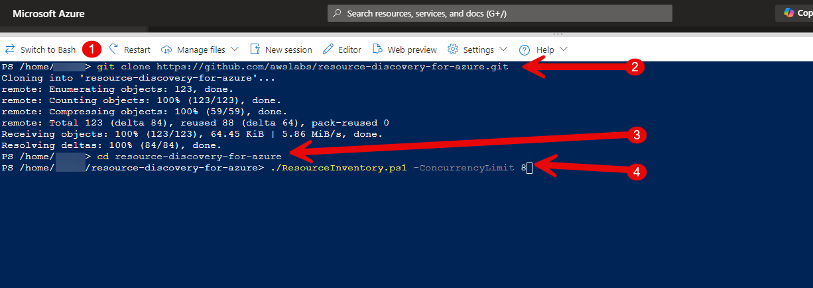

# Resource Discovery for Azure

This is a PowerShell script provided by AWS that generates an inventory report including detailed metrics of an Azure environment to which you have read access for the previous 30 days.

This repository is focusing solely on read-only integrations with Azure APIs and Azure Monitor. Our goal is to deliver a 
reliable and efficient solution for Azure environment reporting, empowering you with comprehensive insights into your cloud resources and their utilization.

By leveraging this script, you can effortlessly generate Excel/JSON exports that provide a comprehensive overview of your Azure environment, including usage statistics, and performance metrics.

## Table of Contents

- [Prerequisites](#prerequisites)
- [Installation](#installation)
- [Running the Script](#running-the-script)

## Prerequisites
The script can be executed in both Azure Cloudshell PowerShell and PowerShell Desktop environments. We recommend running the script in Azure CloudShell at https://shell.azure.com, as this will ensure you are already authenticated with Azure.

The following items are will be needed if you run the script locally.
- PowerShell 7 or Azure CloudShell PowerShell
- Azure CLI
- Azure CLI Account Extension
- Azure CLI Resource-Graph Extension (_This is installed automatically by the script_)
  
The script can be executed in both Azure Cloudshell PowerShell and PowerShell Desktop environments.  
For additional information on Azure CloudShell, please review this [article](https://learn.microsoft.com/en-us/azure/cloud-shell/get-started/classic?tabs=azurecli)

### Requirements
> **Note:** By default, script will attempt to install the necessary PowerShell modules and Azure CLI components, but you need **administrator** privileges during the script execution.
> You can also assign the following Roles in Azure to a user to execute the script:
- Reader Role
- Billing Reader Role
- Monitoring reader Role
- Cost Management Reader Role

## Installation

1. Clone the repository by running the following command

```bash
git clone https://github.com/awslabs/resource-discovery-for-azure.git
```

## Running the Script

The script uses concurrency to execute commands in parallel, especially when gathering metrics. By default, the concurrency limit is set to 6. To change this, use the `-ConcurrencyLimit` option. 

2. If you are in Azure CloudShell please ensure you select PowerShell , you're already authenticated.
3. In PowerShell Desktop, you will be redirected to the Azure sign-in page.
> You might get more than one authentication request due to different collector processes running in parallel, so make sure that you successfully complete it.
4. Change directory to the location where repository was cloned
```powershell
cd resource-discovery-for-azure
```
5. Use the following command to run the script but update **CustomerName** to your company name

```powershell
./ResourceInventory.ps1 -ConcurrencyLimit 8 -ReportName UpdateCustomerName
```

When running the script from CloudShell - the output should be similar to this screenshot -  
For item 1 in the screenshot, it should state Bash as this means you are running in PowerShell



## Downloading the ZIP File from GitHub
If you don't have Git installed, you can download the ZIP file of the repository:

1. In this repo at the top of the page - Click on the green **Code** button - Item 1 in screenshot  
2. Select **Download ZIP** from the dropdown menu - Item 2 in screenshot
3. Extract the downloaded ZIP file to your desired directory on your local computer


## Script Output/Reports
3. When the script has completed, a zip file of the report will be saved in the folder **_InventoryReports._**
     - Script will create multiple files and one zip 
         - Consumption_ResourcesReport_(date).json 
         - Inventory_ResourcesReport_(date).json 
         - Metrics_ResourcesReport_(date).json 
         - ResourcesReport_(date).xlsx 

     - The files are zipped up automatically and the zip
         - ResourcesReport_(date).zip

After you download the ResourcesReport_(date).zip file, please ensure that has your customer name (e.g., CustomerNameResourcesReport_(date).zip) and send the renamed ZIP file back to the AWS team for further analysis.

### Files fail to Zip
If the files fail to zip automatically please run the following command from the **_InventoryReports_** folder
```powershell
zip -r inventoryreport.zip foldername (this is the folder that the files are located)
```
---

## Parameters

The following table lists the parameters that can be used with the script:

| Parameter              | Description                                                                                                 |                               |
|------------------------|-------------------------------------------------------------------------------------------------------------|-------------------------------|
| ReportName             | Specifies the customer name for the file                                                                    | `-ReportName <NAME>`          |
| TenantID               | Specify the tenant ID you want to create a Resource Inventory.                                              | `-TenantID <ID>`              |
| SubscriptionID         | Specifies Subscription(s) to be inventoried.                                                                | `-SubscriptionID <ID>`        |
| ResourceGroup          | Specifies one unique Resource Group to be inventoried                                                       | `-ResourceGroup <NAME>`       |
| Debug                  | Run in a Debug mode.                                                                                        | `-Debug`                      |
| ConcurrencyLimit       | Specifies the concurrency limit for parallel command execution. Default value is `6`.                       | `-ConcurrencyLimit <Integer>` |
| SkipConsumption        | A switch to indicate if consumption metrics should be gathered.                                             | `-SkipConsumption`            |
| Appid                  | Service Principal Authentication ID.                                                                        | `-Appid <String>`             | 
| Secret                 | Client Secret of the Service Principal key.                                                                 | `-Secret <String>`            |
| DeviceLogin            | A switch to trigger device login.                                                                           | `-DeviceLogin`                |

---

## ⚠️ Warning Messages

- **Important:** Script will not upgrade the current version of the Powershell modules.
  
- **Important:** If you're running the script inside Azure CloudShell, the final Excel will not have auto-fit columns, and you will see warnings during the script execution. This is an expected issue with the Import-Excel module but it does **not** affect the inventory which will remain accurate.

---
