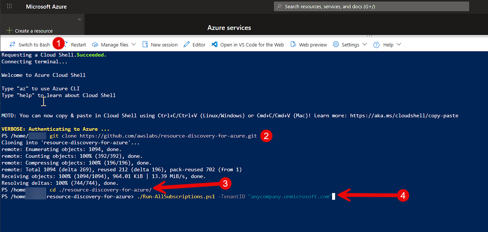
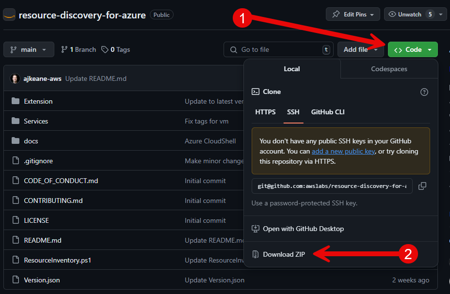

# Azure Resource Discovery Tool

## Overview

The Azure Resource Discovery Tool is a PowerShell script that generates comprehensive inventory reports of your Azure environment. This AWS-provided script creates detailed reports including resource metrics, usage statistics, and performance data from the previous 31 days.

This tool leverages read-only integrations with Azure APIs and Azure Monitor. Our goal is to deliver a reliable and efficient solution for Azure environment reporting, empowering you with comprehensive insights into your cloud resources and their utilization.

**Key Features:**
- Read-only Azure API integration
- Automated Excel and JSON report generation
- 31-day historical metrics collection
- Parallel processing for improved performance
- Support for [Azure Cloud Shell](https://shell.azure.com "Open Azure Cloud Shell") and local PowerShell environments

## Table of Contents

- [Prerequisites](#prerequisites)
- [Getting Started](#getting-started)
- [Usage](#usage)
- [Output Files](#output-files)
- [Parameters Reference](#parameters-reference)
- [Troubleshooting](#troubleshooting)

## Prerequisites

### Required Azure Roles

Before running the script, ensure your Azure user account has the following roles assigned:

- **✅ Reader Role** - Access to view Azure resources
- **✅ Billing Reader Role** - Access to billing and cost data
- **✅ Monitoring Reader Role** - Access to Azure Monitor metrics
- **✅ Cost Management Reader Role** - Access to cost management data

### Environment Options

#### 🚀 Quick Start | Option 1: Azure Cloud Shell (Recommended) ⭐
- No additional setup required
- Pre-authenticated environment
- All dependencies included
- Access at [Azure Cloud Shell](https://shell.azure.com "Open Azure Cloud Shell")

#### Option 2: Local Environment
- [PowerShell 7 or later](https://learn.microsoft.com/en-us/powershell/scripting/install/installing-powershell)
- [Azure CLI](https://learn.microsoft.com/en-us/cli/azure/install-azure-cli)
- [Azure CLI Account Extension](https://learn.microsoft.com/en-us/cli/azure/azure-cli-extensions-overview)
- Azure CLI Resource-Graph Extension (auto-installed by script)
- **Az PowerShell module** and **ImportExcel module** (install before running — see below)

> **Note:** Install the Account Extension before running the script:
> ```powershell
> az extension add --name account
> ```

##### Installing the required PowerShell modules

The script needs both `Az` and `ImportExcel` modules. Install them once before the first run, from an elevated **PowerShell 7** prompt (`pwsh`):

```powershell
Install-Module -Name Az          -Repository PSGallery -Force -AllowClobber -SkipPublisherCheck
Install-Module -Name ImportExcel -Repository PSGallery -Force -AllowClobber -SkipPublisherCheck
```

The script no longer auto-installs these modules from inside its own run. Auto-install during a script that's already importing the same module produces a class of silent broken installs (manifest present, bundled assemblies missing — typically MSAL and Azure.Core for Az), and the failure surfaces much later as zero consumption records or "Cannot find type [OfficeOpenXml.ExcelPackage]" errors. Installing once outside the script, ahead of time, is reliable.

If you suspect a previous run left a broken Az install on disk:

```powershell
Get-Module Az* -ListAvailable | Uninstall-Module -Force
Install-Module -Name Az -Repository PSGallery -Force -AllowClobber -SkipPublisherCheck
```
  


## Getting Started

### Step 1: Access Your Environment

**For Azure Cloud Shell:**
1. Navigate to [Azure Cloud Shell](https://shell.azure.com "Open Azure Cloud Shell")
2. Ensure you're in PowerShell mode (not Bash)
3. You're automatically authenticated



**For Local Environment:**
1. Open PowerShell 7 as Administrator
2. Ensure Azure CLI is installed and configured

### Step 2: Download the Script

**Option A: Git Clone**
```bash
git clone https://github.com/awslabs/resource-discovery-for-azure.git
```

**Option B: Direct Download**
1. Click the green **Code** button on this repository
2. Select **Download ZIP**
3. Extract to your desired directory



## Usage

### Authentication Notes

- **Azure Cloud Shell:** Authentication is automatic
- **Local PowerShell:** Run `az login` and `Connect-AzAccount` before executing the script. If you plan to scan all subscriptions in a tenant, use `Run-AllSubscriptions.ps1`, which prompts you to sign in once and then reuses the session for every subscription.

You might get more than one authentication request due to different collector processes running in parallel.

### Basic Execution

1. **Navigate to the script directory:**
   ```powershell
   cd resource-discovery-for-azure
   ```

2. **Run the script with your organization name:**
   ```powershell
   ./ResourceInventory.ps1 -ReportName "YourCompanyName" -ConcurrencyLimit 6
   ```

### Advanced Usage Examples

**Scan specific subscription:**
```powershell
./ResourceInventory.ps1 -ReportName "CompanyName" -SubscriptionID "12345678-1234-1234-1234-123456789012"
```

**Scan specific resource group:**
```powershell
./ResourceInventory.ps1 -ReportName "CompanyName" -ResourceGroup "MyResourceGroup"
```

**Adjust performance settings:**
```powershell
./ResourceInventory.ps1 -ReportName "CompanyName" -ConcurrencyLimit 8
```

**Skip consumption:**
```powershell
./ResourceInventory.ps1 -ReportName "CompanyName" -SkipConsumption
```

**Skip metrics:**
```powershell
./ResourceInventory.ps1 -ReportName "CompanyName" -SkipMetrics
```

**Generate obfuscated report (mask sensitive data before sharing):**
```powershell
./ResourceInventory.ps1 -ReportName "CompanyName" -Obfuscate
```

### Running Across All Subscriptions

Use `Run-AllSubscriptions.ps1` to generate a separate inventory report for each subscription in a tenant, instead of the default single consolidated report. The wrapper prompts you to sign in once, then invokes `ResourceInventory.ps1` for each subscription sequentially.

```powershell
./Run-AllSubscriptions.ps1 -TenantID "12345678-1234-1234-1234-123456789012"
```

`-TenantID` accepts either a tenant GUID or a verified domain. When a domain is passed (for example `contoso.onmicrosoft.com`), the wrapper resolves it to the GUID via Microsoft's anonymous OIDC discovery endpoint before doing anything else, so this also works:

```powershell
./Run-AllSubscriptions.ps1 -TenantID "contoso.onmicrosoft.com"
```

Each subscription produces its own set of timestamped reports in `InventoryReports/`. After all subscriptions are processed, the wrapper bundles the per-subscription ZIPs into a single `AllSubscriptions_ResourcesReport_<timestamp>.zip` in the same folder for easy delivery.

#### Subscription state filter

By default, `Run-AllSubscriptions.ps1` only inventories subscriptions whose `State` is `Enabled`. Subscriptions in any other state (`Disabled`, `Warned`, `PastDue`, `Deleted`) are skipped because they return little or no data from Resource Graph and most ARM data-plane calls, so processing them produces near-empty reports while still costing wall-clock time.

To include every subscription regardless of state, pass `-IncludeDisabled`:

```powershell
./Run-AllSubscriptions.ps1 -TenantID "12345678-1234-1234-1234-123456789012" -IncludeDisabled
```

The wrapper prints the count of excluded subscriptions and a per-state breakdown so the filter is transparent.

#### Resuming an interrupted run

For tenants with many subscriptions, the run can be cut short by environment-level limits — for example, an Azure Cloud Shell session that ends when a Conditional Access policy enforces a maximum session lifetime. The wrapper supports resuming:

```powershell
./Run-AllSubscriptions.ps1 -TenantID "12345678-1234-1234-1234-123456789012" -Resume
```

After each subscription is fully processed (its per-subscription ZIP has been written), the wrapper records the subscription ID in a state file at `InventoryReports/.resume-state-<TenantID>.json`. Re-running with `-Resume` reads that file and skips subscriptions that are already complete; the partially processed subscription (the one that was running when the session ended) is re-run from the start. The state file is cleared automatically after a clean run with no failures.

`-Resume` is opt-in. Without it, the wrapper processes every subscription returned by `Get-AzSubscription`, and existing state is left untouched.

#### Run transcript and failure diagnostics

Every invocation of `Run-AllSubscriptions.ps1` writes a wrapper-level transcript to `InventoryReports/RunAllSubscriptions_transcript_<timestamp>.txt`. Unlike the per-subscription transcripts that `ResourceInventory.ps1` writes inside each subscription folder, this file captures the full wrapper run end-to-end: tenant resolution, authentication decisions, resume-state messages, the cross-iteration narration of which subscription is being processed, the consolidation step, and the final summary. This applies to every run, single subscription or many.

If a subscription fails, the wrapper additionally writes a structured failure log to `InventoryReports/RunAllSubscriptions_failures_<timestamp>.log` containing the full exception type, message, up to five levels of `InnerException`, the script line, stack traces, and a snapshot of process memory and free disk at failure time. The final summary points at both files when failures have occurred.

When reporting an issue, attach both files. They contain enough context to diagnose most failures without a follow-up round trip.

## Output Files

Upon completion, the script generates reports in the `InventoryReports` folder:

### Generated Files

| File | Description |
|------|-------------|
| `Consumption_ResourcesReport_(date).json` | Cost and billing data |
| `Inventory_ResourcesReport_(date).json` | Complete resource inventory |
| `Metrics_ResourcesReport_(date).json` | Performance metrics data |
| `ResourcesReport_(date).xlsx` | Consolidated Excel report |
| `Transcript_Log(date).xlsx` | Transcript log of script activity during the run |
| `ResourcesReport_(date).zip` | All files compressed |

### File Delivery

1. **Locate the output:** Check the `InventoryReports` folder
2. **Rename the ZIP file:** Include your company name (e.g., `CompanyName_ResourcesReport_2024-01-15.zip`)
3. **Deliver to AWS team:** Send the renamed ZIP file for analysis

### Obfuscation Mode

When using `-Obfuscate`, the following data is masked in all output files:

| Category | What is masked | Masked Format |
|----------|---------------|---------------|
| Resource ID | All resource IDs across inventory, metrics, and consumption | `prod_<guid>` or `nonprod_<guid>` |
| Resource Name | All resource names | `prod_<guid>` or `nonprod_<guid>` |
| Subscription | Subscription names (deterministic — same real sub always maps to the same value) | `prod_<guid>` or `nonprod_<guid>` |
| Resource Group | Resource group names (deterministic — same real RG always maps to the same value) | `prod_<guid>` or `nonprod_<guid>` |
| Tags | All resource tags stripped | `null` |
| Cross-references | Fields that reference other resources by name or ID (e.g. DatabaseServer, ManagedInstance, HostId, StorageAccount, KeyVault, WAF policy) | Dictionary lookup or `obfuscated` |
| Consumption IDs | ReservationId and ReservationOrderId in billing data | `obfuscated` |
| User identity | Fields containing user emails or identity (e.g. Purview CreatedBy) | `obfuscated` |

Resources with names matching dev/test/qa patterns (including short prefixes like `d-`, `t-`, `s-`) get a `nonprod_` prefix; all others get `prod_`. This preserves environment classification without exposing real names.

**Deterministic mapping:** The same real subscription or resource group always maps to the same obfuscated value within a run. This means pivot tables, grouping, and cross-referencing all work correctly in the obfuscated output.

**Reverse-lookup dictionary:** A local `ObfuscationDictionary_*.json` file maps every obfuscated value back to the real resource. This file stays with the customer and is never included in the ZIP. When the receiving party asks about a specific obfuscated name, the customer looks it up in the dictionary and responds.

**What is preserved:** Location, SKU, VM size, OS type, disk type, metrics values, consumption quantities, and all technical configuration data needed for analysis.

**What is excluded from the ZIP:**
- Transcript log (contains raw console output with emails, subscription IDs, file paths)
- Obfuscation dictionary (contains the real-to-obfuscated mapping)

### Manual Compression (If Needed)

If automatic compression fails:
```powershell
cd InventoryReports
Compress-Archive -Path ./* -DestinationPath "CompanyName_ResourcesReport_$(Get-Date -Format 'yyyy-MM-dd').zip"
```
## Parameters Reference

### Core Parameters

| Parameter | Type | Description | Example |
|-----------|------|-------------|----------|
| `ReportName` | String | **Required.** Company/customer name for file naming | `-ReportName "AcmeCorp"` |
| `TenantID` | String | Target specific Azure tenant | `-TenantID "12345678-1234-1234-1234-123456789012"` |
| `SubscriptionID` | String | Scan single subscription only | `-SubscriptionID "87654321-4321-4321-4321-210987654321"` |
| `ResourceGroup` | String | Scan specific resource group only | `-ResourceGroup "Production-RG"` |

### Performance Parameters

| Parameter | Type | Description | Default | Example |
|-----------|------|-------------|---------|----------|
| `ConcurrencyLimit` | Integer | Parallel execution limit | 6 | `-ConcurrencyLimit 8` |
| `CollectionDays` | Integer | Number of days for consumption lookback | 31 | `-CollectionDays 14` |
| `SkipConsumption` | Switch | Skip cost/billing data collection | False | `-SkipConsumption` |
| `SkipMetrics` | Switch | Skip Azure Monitor metrics collection | False | `-SkipMetrics` |

### Privacy & Obfuscation Parameters

| Parameter | Type | Description | Example |
|-----------|------|-------------|----------|
| `Obfuscate` | Switch | Replace resource IDs, names, subscriptions, resource groups, and tags with masked values. A reverse-lookup dictionary is saved locally. Reports can be safely shared externally without exposing sensitive Azure environment details. | `-Obfuscate` |

### Authentication Parameters

| Parameter | Type | Description | Example |
|-----------|------|-------------|----------|
| `Appid` | String | Service Principal application ID | `-Appid "app-id-here"` |
| `Secret` | String | Service Principal client secret | `-Secret "secret-here"` |
| `DeviceLogin` | Switch | Use device code authentication | `-DeviceLogin` |

### Debugging Parameters

| Parameter | Type | Description | Example |
|-----------|------|-------------|----------|
| `Debug` | Switch | Enable debug mode output | `-Debug` |

## Troubleshooting

### Common Issues

**Downloaded ZIP File:**
- If you download the ZIP file, Windows may mark the files as blocked for security reasons which is a known issue from GitHub
- Run the following PowerShell command to unblock all files in Resource Discovery in Azure folder  
   `Get-ChildItem -Path . -Recurse | Unblock-File`
- After unblocking, you can execute the script from the folder

**Authentication Errors:**
- Ensure you have the required Azure roles assigned
- For local environments, run `az login` before executing the script
- Multiple authentication prompts may appear due to parallel processing

**Performance Issues:**
- Reduce `ConcurrencyLimit` if experiencing timeouts
- Use `SkipConsumption` to speed up execution. This is not recommended, as it greatly reduces the usefulness of the report.
- Consider targeting specific subscriptions or resource groups

**Excel Formatting (Azure Cloud Shell):**
- Auto-fit columns may not work in Cloud Shell
- Warning messages are expected and don't affect data accuracy
- Download and open locally for proper formatting

### Important Notes

- The script does not upgrade existing PowerShell modules
- Resource-Graph extension installs automatically if missing
- All operations are read-only and safe to execute
- Historical data covers the previous 31 days
