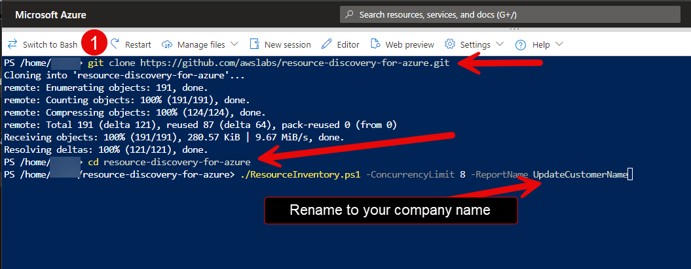

# Azure Resource Discovery Tool

## Overview

The Azure Resource Discovery Tool is a PowerShell script that generates comprehensive inventory reports of your Azure environment. This AWS-provided script creates detailed reports including resource metrics, usage statistics, and performance data from the previous 31 days.

This tool leverages read-only integrations with Azure APIs and Azure Monitor. Our goal is to deliver a reliable and efficient solution for Azure environment reporting, empowering you with comprehensive insights into your cloud resources and their utilization.

**Key Features:**
- Read-only Azure API integration
- Automated Excel and JSON report generation
- 31-day historical metrics collection
- Parallel processing for improved performance
- Support for [Azure Cloud Shell](https://shell.azure.com "Open Azure Cloud Shell") and local PowerShell environments

## Table of Contents

- [Prerequisites](#prerequisites)
- [Getting Started](#getting-started)
- [Usage](#usage)
- [Output Files](#output-files)
- [Parameters Reference](#parameters-reference)
- [Troubleshooting](#troubleshooting)

## Prerequisites

### Required Azure Roles

Before running the script, ensure your Azure user account has the following roles assigned:

- **Reader Role** - Access to view Azure resources
- **Billing Reader Role** - Access to billing and cost data
- **Monitoring Reader Role** - Access to Azure Monitor metrics
- **Cost Management Reader Role** - Access to cost management data

### Environment Options

#### Option 1: Azure Cloud Shell (Recommended)
- No additional setup required
- Pre-authenticated environment
- All dependencies included
- Access at [Azure Cloud Shell](https://shell.azure.com "Open Azure Cloud Shell")

#### Option 2: Local Environment
- PowerShell 7 or later
- Azure CLI
- Azure CLI Account Extension
- Azure CLI Resource-Graph Extension (auto-installed by script)
  


## Getting Started

### Step 1: Access Your Environment

**For Azure Cloud Shell:**
1. Navigate to [Azure Cloud Shell](https://shell.azure.com "Open Azure Cloud Shell")
2. Ensure you're in PowerShell mode (not Bash)
3. You're automatically authenticated



**For Local Environment:**
1. Open PowerShell 7 as Administrator
2. Ensure Azure CLI is installed and configured

### Step 2: Download the Script

**Option A: Git Clone**
```bash
git clone https://github.com/awslabs/resource-discovery-for-azure.git
```

**Option B: Direct Download**
1. Click the green **Code** button on this repository
2. Select **Download ZIP**
3. Extract to your desired directory


## Usage

### Authentication Notes

- **Azure Cloud Shell:** Authentication is automatic
- **Local PowerShell:** You'll be redirected to Azure sign-in

You might get more than one authentication request due to different collector processes running in parallel.

### Basic Execution

1. **Navigate to the script directory:**
   ```powershell
   cd resource-discovery-for-azure
   ```

2. **Run the script with your organization name:**
   ```powershell
   ./ResourceInventory.ps1 -ReportName "YourCompanyName" -ConcurrencyLimit 4
   ```

### Advanced Usage Examples

**Scan specific subscription:**
```powershell
./ResourceInventory.ps1 -ReportName "CompanyName" -SubscriptionID "12345678-1234-1234-1234-123456789012"
```

**Scan specific resource group:**
```powershell
./ResourceInventory.ps1 -ReportName "CompanyName" -ResourceGroup "MyResourceGroup"
```

**Adjust performance settings:**
```powershell
./ResourceInventory.ps1 -ReportName "CompanyName" -ConcurrencyLimit 8
```

**Skip consumption metrics:**
```powershell
./ResourceInventory.ps1 -ReportName "CompanyName" -SkipConsumption
```

## Output Files

Upon completion, the script generates reports in the `InventoryReports` folder:

### Generated Files

| File | Description |
|------|-------------|
| `Consumption_ResourcesReport_(date).json` | Cost and billing data |
| `Inventory_ResourcesReport_(date).json` | Complete resource inventory |
| `Metrics_ResourcesReport_(date).json` | Performance metrics data |
| `ResourcesReport_(date).xlsx` | Consolidated Excel report |
| `ResourcesReport_(date).zip` | All files compressed |

### File Delivery

1. **Locate the output:** Check the `InventoryReports` folder
2. **Rename the ZIP file:** Include your company name (e.g., `CompanyName_ResourcesReport_2024-01-15.zip`)
3. **Deliver to AWS team:** Send the renamed ZIP file for analysis

### Manual Compression (If Needed)

If automatic compression fails:
```powershell
cd InventoryReports
Compress-Archive -Path ./* -DestinationPath "CompanyName_ResourcesReport_$(Get-Date -Format 'yyyy-MM-dd').zip"
```
## Parameters Reference

### Core Parameters

| Parameter | Type | Description | Example |
|-----------|------|-------------|----------|
| `ReportName` | String | **Required.** Company/customer name for file naming | `-ReportName "AcmeCorp"` |
| `TenantID` | String | Target specific Azure tenant | `-TenantID "12345678-1234-1234-1234-123456789012"` |
| `SubscriptionID` | String | Scan single subscription only | `-SubscriptionID "87654321-4321-4321-4321-210987654321"` |
| `ResourceGroup` | String | Scan specific resource group only | `-ResourceGroup "Production-RG"` |

### Performance Parameters

| Parameter | Type | Description | Default | Example |
|-----------|------|-------------|---------|----------|
| `ConcurrencyLimit` | Integer | Parallel execution limit | 6 | `-ConcurrencyLimit 8` |
| `SkipConsumption` | Switch | Skip cost/billing data collection | False | `-SkipConsumption` |

### Authentication Parameters

| Parameter | Type | Description | Example |
|-----------|------|-------------|----------|
| `Appid` | String | Service Principal application ID | `-Appid "app-id-here"` |
| `Secret` | String | Service Principal client secret | `-Secret "secret-here"` |
| `DeviceLogin` | Switch | Use device code authentication | `-DeviceLogin` |

### Debugging Parameters

| Parameter | Type | Description | Example |
|-----------|------|-------------|----------|
| `Debug` | Switch | Enable debug mode output | `-Debug` |

## Troubleshooting

### Common Issues

**Authentication Errors:**
- Ensure you have the required Azure roles assigned
- For local environments, run `az login` before executing the script
- Multiple authentication prompts may appear due to parallel processing

**Performance Issues:**
- Reduce `ConcurrencyLimit` if experiencing timeouts
- Use `SkipConsumption` to speed up execution. This is not recommended, as it greatly reduces the usefulness of the report.
- Consider targeting specific subscriptions or resource groups

**Excel Formatting (Azure Cloud Shell):**
- Auto-fit columns may not work in Cloud Shell
- Warning messages are expected and don't affect data accuracy
- Download and open locally for proper formatting

### Important Notes

- The script does not upgrade existing PowerShell modules
- Resource-Graph extension installs automatically if missing
- All operations are read-only and safe to execute
- Historical data covers the previous 31 days
